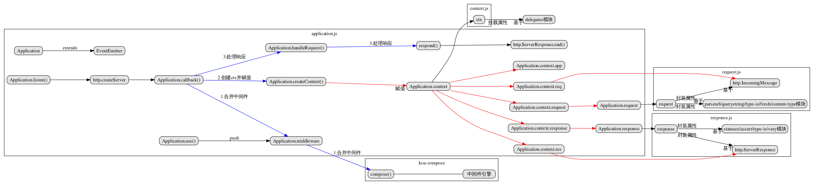

## koa源码



##### 初始化

```
const Koa = require('koa');
const app = new Koa();
app.listen(3000);
```

在new koa()的时候,继承Emitter，具备处理异步事件的能力,初始化了 context，request， response.当然还有middleware数组以及一些初始配置。

然后在listen时才会去createServer，调用app.callback函数，主要执行了三步

1. 通过koa-compose模块，对中间件列表进行合并处理，实现洋葱模型，
2. 为每一个相应创建ctx对象，通过app.createContext方法创建ctx对象
3. 处理响应，通过app.handleRequest方法处理响应，底层基于ServerResponse.end方法。

##### koa中要分清楚两组对象

* request,response是koa的拓展对象
* req,res是node的原生对象（http.IncomingMessage和http.ServerResponse）

koa的request和response通过getter和setter来拓展了req和res。然后为了方便调用这些属性,又将request和response代理到了context上，代理采用了`delegates`
属性的代理使用Object.defineProperty

```js
function access(proto, target, name) {
  Object.defineProperty(proto, name, {
    get() {
      return target[name];
    }
    set(val) {
      target[name] = val;
    }
  })
}
access(context, request, 'header')
```
对象的代理使用bind
```js
function method(proto, target, name) {
  proto[name] = function() {
    return target[name].bind(target, arguments)
  }
}
```
##### 单一context原则

每一个http请求，koa都会通过app.createContext创建一个context并共享给所有的全局中间件使用，所有的关于请求和响应的东西都放在其里面。同时我们也创建了request和response，并且将app、req、res、ctx也存放在了request、和response对象中。这样我们将这些职责进行划分，比如request是进一步封装req的，response是进一步封装res的。

##### koa-compose

koa-compose的源码如下

```js
module.exports = compose

/**
 * Compose `middleware` returning
 * a fully valid middleware comprised
 * of all those which are passed.
 *
 * @param {Array} middleware
 * @return {Function}
 * @api public
 */

function compose (middleware) {
    //传入的 middleware 参数必须是数组
  if (!Array.isArray(middleware)) throw new TypeError('Middleware stack must be an array!')
  //middleware 数组的元素必须是函数
  for (const fn of middleware) {
    if (typeof fn !== 'function') throw new TypeError('Middleware must be composed of functions!')
  }

  /**
   * @param {Object} context
   * @return {Promise} 返回一个闭包函数，函数的返回是一个Promise 对象, 保持对 middleware 的引用。
   * @api public
   */

  return function (context, next) {
    // last called middleware #
    let index = -1
    return dispatch(0)
    function dispatch (i) {
      if (i <= index) return Promise.reject(new Error('next() called multiple times'))
      index = i
      let fn = middleware[i]
      if (i === middleware.length) fn = next
      if (!fn) return Promise.resolve()
      try {
        return Promise.resolve(fn(context, dispatch.bind(null, i + 1)));
      } catch (err) {
        return Promise.reject(err)
      }
    }
  }
}
```

我们去掉其他的条件判断，只看最重要的代码

`return Promise.resolve(fn(context, dispatch.bind(null, i + 1)));`

我们使用app.use来将中间件传入，中间件接受两个参数context和next，所以这里的`dispatch.bind(null, i + 1)`就是我们的next，所以当我们在中间件中调用next时就会去调用在中间件数组中的下一个中间件。

```js
const Koa = require('koa');
const app = new Koa();

app.use(async (ctx, next) => {
    console.log('第一个中间件函数')
    await next();
    console.log('第一个中间件函数next之后!');
})
app.use(async (ctx, next) => {
    console.log('第二个中间件函数')
    await next();
    console.log('第二个中间件函数next之后!');
})

/** 通过conpose处理后我们可以把上面内容看做
Promise.resolve(async (ctx, next) => Promise.resolve(async (ctx, next) => {
    console.log('第一个中间件函数')
    Promise.resolve((async (ctx, next) => {
        console.log('第二个中间件函数')
        await next();
        console.log('第二个中间件函数next之后');
    })(context, dispatch.bind(null, i + 1)));
    console.log('第一个中间件函数next之后')
}))
**/

app.use(async ctx => {
    ctx.body = 'Hello World';
});

app.listen(3000); 
//第一个中间件函数
//第二个中间件函数
//第二个中间件函数next之后!
//第一个中间件函数next之后!
```
如果仅仅是这些的话，只是通过函数调用栈的执行顺序的话，其实express也能实现,
```js
const express = require("express");

const app = express()

app.use(function m1 (req, res, next) {
  console.log('m1')
  next()
  console.log('m1 end')
})

app.use(function m2 (req, res, next) {
  console.log('m2')
  next()
  console.log('m2 end')
})

app.use(function m3 (req, res, next) {
  console.log('m3')
  res.end('hello')
})

app.listen(8080)
```
重点在于`res.end()`的时机，express使用res.end()直接返回数据,而koa可以在中间件中不断的修改ctx.body来设置数据,并不直接响应res.end(),然后在handleRequest的代码中我们可以看到，中间件执行完后我们才去handleResponse，这个时候才会执行res.end(ctx.body)。这样就给响应前的操作留下来空间，请求和响应都在中间件之外，因此才被成为洋葱模型

`return fnMiddleware(ctx).then(handleResponse).catch(onerror);`
具体可以参考 [koa原理分析](https://omnipotent-front-end.github.io/library/koa.html#koa%E7%9A%84%E6%B4%8B%E8%91%B1%E6%A8%A1%E5%9E%8B%E6%98%AF%E6%80%8E%E4%B9%88%E7%90%86%E8%A7%A3%E7%9A%84%EF%BC%9F)
[koa和express的区别](https://github.com/koajs/koa/blob/master/docs/koa-vs-express.md)
